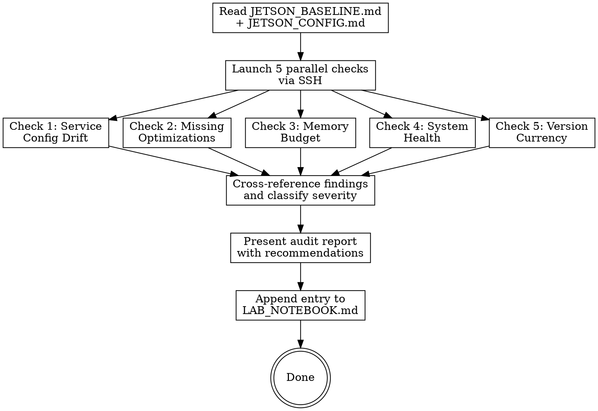

# Jetson Audit

Live configuration audit of the Jetson Orin Nano Super inference system. SSHes into the device, inspects the running llama.cpp server and system state, compares against documented best practices in JETSON_BASELINE.md, and reports optimization opportunities.

**This skill reads the live system. It never modifies it.**

## Required Files

| File | Location | Purpose |
|------|----------|---------|
| `JETSON_BASELINE.md` | Jetson project root (`~/dev/personal/jetson/`) | Performance baselines + known-best config to compare against |
| `JETSON_CONFIG.md` | Jetson project root | Documented system config (ground truth for drift detection) |
| `LAB_NOTEBOOK.md` | Jetson project root | Append-only audit results log |

If any required file is missing, note it in the report and proceed with available data.

## Connection

```bash
ssh -i ~/.ssh/id_claude_code claude@jetson.k4jda.net
```

The `claude` user has passwordless sudo for systemctl and other system commands.

## Execution Flow



## The Five Checks

### Check 1 -- Service Config Drift

**Purpose:** Detect differences between documented config (JETSON_CONFIG.md) and actual running config.

**Commands:**
```bash
# Service status
systemctl status myscript

# Read the actual launch script to extract llama-server flags
cat ~/llm-server/start.sh 2>/dev/null || cat ~/llm-server/run.sh 2>/dev/null

# Current mode
cat ~/llm-server/mode.txt 2>/dev/null

# Check what process is actually running and its flags
ps aux | grep llama-server | grep -v grep
# Or alternatively:
pgrep -a llama

# Check if server is listening
ss -tlnp | grep -E '(8080|8081)'
```

**Analysis:**
1. Extract the actual llama-server command line flags from the running process.
2. Compare against the documented config in JETSON_CONFIG.md.
3. Flag any differences as DRIFT items:
   - **CRITICAL:** Wrong model path, missing GPU offload, wrong port
   - **WARNING:** Flag differences (context size, thread count, parallel slots)
   - **INFO:** Cosmetic differences, default values made explicit

**Return:** Drift report with severity classification.

### Check 2 -- Missing Optimizations

**Purpose:** Compare running llama-server flags against known best practices for Jetson Orin Nano.

**Analysis:**

Check for the presence/absence of these flags:

| Flag | Best Practice | Severity if Missing |
|------|--------------|-------------------|
| `-ngl 999` or `--gpu-layers 999` | Full GPU offload (all layers) | CRITICAL |
| `-fa` or `--flash-attn` | Flash attention for memory efficiency | HIGH |
| `--mlock` | Lock model in memory (prevent swap) | HIGH |
| `-ctk q8_0` or `--cache-type-k q8_0` | Quantized KV cache (saves memory) | MEDIUM |
| `-ctv q8_0` or `--cache-type-v q8_0` | Quantized KV cache values | MEDIUM |
| `-c 32768` or appropriate context | Context size matches model capability | MEDIUM |
| `-np 1` or `--parallel 1` | Appropriate parallel slot count for 8 GB | MEDIUM |
| `-t 1` or `--threads 1` | Single thread (GPU-bound, more threads waste cycles) | LOW |
| `--cont-batching` | Continuous batching for concurrent requests | LOW |

Check for anti-patterns:
| Anti-Pattern | Check | Severity |
|-------------|-------|----------|
| `-ngl 0` or missing GPU offload | All inference on CPU = extremely slow | CRITICAL |
| Context size > model max | Wastes memory, may cause errors | HIGH |
| `--threads` > 2 | GPU-bound workload, extra CPU threads add overhead | MEDIUM |
| `--parallel` > 2 on 8 GB | Each slot needs KV cache memory | MEDIUM |
| No `--mlock` with swap enabled | Model pages to swap under pressure | MEDIUM |

**Return:** List of missing optimizations with severity and expected impact.

### Check 3 -- Memory Budget

**Purpose:** Verify memory allocation is healthy for the 8 GB unified memory constraint.

**Commands:**
```bash
free -h
swapon --show
# RSS of the llama-server process
ps -o pid,rss,vsz,comm -p $(pgrep llama-server) 2>/dev/null
# Or broader:
ps aux --sort=-rss | head -10
# Tegra memory info (if available)
cat /sys/kernel/debug/nvmap/iovmm/clients 2>/dev/null | head -20
# Available vs total
cat /proc/meminfo | grep -E '(MemTotal|MemAvailable|SwapTotal|SwapFree|Buffers|Cached)'
```

**Analysis:**

| Metric | Healthy | Warning | Critical |
|--------|---------|---------|----------|
| Available RAM | > 500 MB | 200-500 MB | < 200 MB |
| Swap used | < 50 MB | 50-500 MB | > 500 MB |
| llama-server RSS | < baseline + 20% | +20-50% above baseline | > +50% or > 6 GB |
| Total RSS (all processes) | < 7 GB | 7-7.5 GB | > 7.5 GB |

**Memory budget calculation:**
1. Model size in memory (GGUF Q4_K_M ~3 GB for 4B model)
2. KV cache: context_size x layers x head_dim x 2 (K+V) x quant_factor
3. Working memory: ~200-400 MB for llama.cpp runtime
4. OS + other processes: ~1-1.5 GB
5. Total must fit in 8 GB with >= 500 MB headroom

**Return:** Memory budget table, swap status, whether model fits comfortably.

### Check 4 -- System Health

**Purpose:** Check overall system health indicators.

**Commands:**
```bash
uptime
# Thermals (Jetson-specific)
cat /sys/devices/virtual/thermal/thermal_zone*/temp 2>/dev/null
cat /sys/devices/virtual/thermal/thermal_zone*/type 2>/dev/null
# Or tegrastats snapshot
sudo tegrastats --interval 1000 --count 3 2>/dev/null
# Fan status (if managed)
cat /sys/devices/pwm-fan/target_pwm 2>/dev/null
# Power mode
sudo nvpmodel -q 2>/dev/null
# Clock frequencies
sudo jetson_clocks --show 2>/dev/null
# Disk usage
df -h /
# Journal errors (last hour)
journalctl --since "1 hour ago" --priority=err --no-pager | tail -20
# Quick inference test
curl -s http://localhost:8080/v1/chat/completions \
  -H 'Content-Type: application/json' \
  -d '{"model":"default","messages":[{"role":"user","content":"Say hello in exactly 5 words"}],"max_tokens":32}' | \
  python3 -c 'import sys,json; r=json.load(sys.stdin); u=r.get("usage",{}); print(f"Tokens: {u.get(\"completion_tokens\",\"?\")}, Gen speed: check /slots endpoint")'
# Slot status
curl -s http://localhost:8080/slots 2>/dev/null | python3 -c 'import sys,json; s=json.load(sys.stdin); print(f"Slots: {len(s)}, Busy: {sum(1 for x in s if x.get(\"is_processing\",False))}")' 2>/dev/null
```

**Analysis:**
| Check | Healthy | Warning | Critical |
|-------|---------|---------|----------|
| Inference responds | Yes, < 5s | Slow (> 10s) | No response / error |
| GPU temp (idle) | < 50C | 50-65C | > 65C |
| GPU temp (load) | < 65C | 65-80C | > 80C |
| Power mode | MAXN (15W) | 10W mode | Unknown / 7W |
| Disk usage | < 70% | 70-85% | > 85% |
| System uptime | Stable (> 1 day) | < 1 day | Service down |
| Journal errors | None relevant | GPU/CUDA warnings | OOM kills |

**Inference speed check:**
If possible, measure generation tok/s from the inference test. Compare against `baseline_gen_tok_s` from JETSON_BASELINE.md.
- Within 15%: OK
- 15-30% below: WARNING (thermal throttling? memory pressure?)
- > 30% below: CRITICAL

**Return:** Health status per component, thermals, inference speed, anomalies.

### Check 5 -- Version Currency

**Purpose:** Compare running versions against latest known-good versions.

**Commands:**
```bash
# llama.cpp version
cd ~/llm-server/llama.cpp && git log --oneline -1
# Or binary version:
~/llm-server/llama.cpp/build/bin/llama-server --version 2>/dev/null || \
  ~/llm-server/llama-server --version 2>/dev/null
# JetPack version
cat /etc/nv_tegra_release 2>/dev/null
dpkg -l nvidia-jetpack 2>/dev/null | grep nvidia-jetpack
# CUDA version
nvcc --version 2>/dev/null | grep release
# Kernel
uname -r
# L4T version
head -1 /etc/nv_tegra_release 2>/dev/null
# Model file
ls -la ~/llm-server/models/ 2>/dev/null | grep -i gguf
```

**Analysis:**
Compare against JETSON_BASELINE.md version tracking:
- llama.cpp: compare against `llamacpp_latest_seen`
- JetPack: compare against `jetpack_latest_orin_nano`
- CUDA: note version for compatibility context
- Model: verify matches `current_model`

Flag version gaps:
| Gap | Severity |
|-----|----------|
| llama.cpp > 5 builds behind latest | HIGH |
| llama.cpp 1-5 builds behind | MEDIUM |
| JetPack behind latest for Orin Nano | INFO (reflash required, high effort) |
| Model file doesn't match documented model | WARNING |

**Return:** Version comparison table, upgrade recommendations.

## Overall Classification

After all five checks:

| Status | Criteria |
|--------|----------|
| **NEEDS ATTENTION** | Any CRITICAL finding, or >= 3 HIGH findings, or service DOWN |
| **OPTIMIZATION AVAILABLE** | Any HIGH finding (no CRITICAL), missing key optimizations |
| **HEALTHY** | No HIGH or CRITICAL findings, config matches best practices |

## Console Report Format

```
## Jetson Audit -- {DATE}
Overall: {NEEDS ATTENTION / OPTIMIZATION AVAILABLE / HEALTHY}

### Service Config Drift
{drift items or "No drift detected — running config matches documentation"}

### Missing Optimizations
{missing flags/settings with severity and expected impact, or "All known optimizations applied"}

### Memory Budget
| Component | Memory | Status |
|-----------|--------|--------|
| Model (GGUF) | {X} GB | {OK} |
| KV Cache | {X} GB | {OK/TIGHT} |
| Runtime | {X} MB | {OK} |
| OS + Other | {X} GB | {OK} |
| **Total** | {X} GB / 8 GB | {headroom: X MB} |
Swap: {X} MB ({OK/WARNING/CRITICAL})

### System Health
- Uptime: {N} days, service {running/stopped}
- Power mode: {MAXN/10W/7W}
- Thermals: GPU {X}C, CPU {X}C
- Inference: {X} tok/s (baseline: {Y})
- Disk: {X}% used
- Slots: {X} total, {Y} busy

### Version Currency
| Component | Running | Latest Known | Gap |
|-----------|---------|-------------|-----|
| llama.cpp | {X} | {Y} | {none/behind by N} |
| JetPack | {X} | {Y} | {current/behind} |
| CUDA | {X} | {Y} | {current} |
| Model | {name} | {expected} | {match/mismatch} |

### Recommendations
1. {Priority-ordered list of actions, or "System is optimally configured"}
```

## LAB_NOTEBOOK Entry

Append using `Edit` tool. Auto-increment entry number by reading the last `## Entry NNN` or `### Entry NNN` line.

```markdown
### Entry {N} -- Jetson Audit ({YYYY-MM-DD})
**Date:** {YYYY-MM-DD HH:MM} UTC
**Operator:** Claude Code (jetson-audit skill)
**Status:** AUDIT -- no changes made

#### Config Drift: {drift items or "None"}
#### Missing Optimizations: {items or "None"}
#### Memory Budget: {X} / 8 GB, swap {X} MB, headroom {X} MB
#### System Health: {HEALTHY/DEGRADED/DOWN}, GPU {X}C, {X} tok/s
#### Version Currency: {current or behind on N components}
#### Overall: {STATUS}
#### Recommendations: {list or "No action needed"}
```
