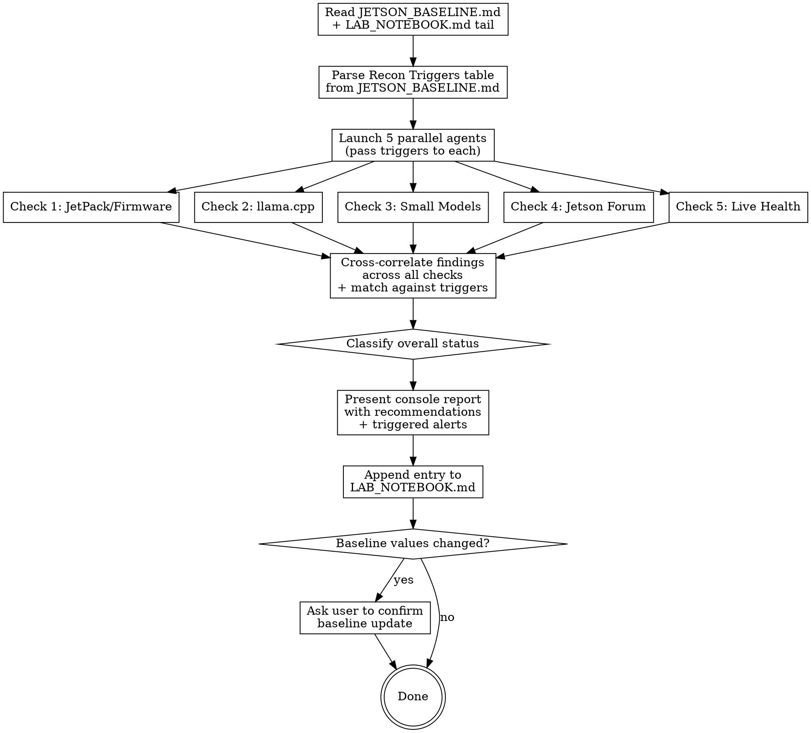

# Jetson Recon

Periodic intelligence scan of the Jetson Orin Nano Super inference landscape. Five parallel checks, compared against stored baselines, classified by urgency, cross-correlated, results appended to LAB_NOTEBOOK.md.

**This skill is report + recommend only. It never touches the Jetson system.**

## Required Files

| File | Location | Purpose |
|------|----------|---------|
| `JETSON_BASELINE.md` | Jetson project root (`~/dev/personal/jetson/`) | Performance numbers + last-checked dates + watch items |
| `LAB_NOTEBOOK.md` | Jetson project root | Append-only results log |
| `JETSON_CONFIG.md` | Jetson project root | Hardware/software inventory (read-only reference) |

If `JETSON_BASELINE.md` doesn't exist, create it using the template at the bottom of this skill.

## Execution Flow



## Recon Triggers

Before launching the five checks, read the `## Recon Triggers` table from JETSON_BASELINE.md. This table contains user-defined patterns that should be matched against findings from each check.

**Table format:**
```markdown
| Source | Pattern | Action | Added |
|--------|---------|--------|-------|
| llamacpp_release | keyword1 AND (keyword2 OR keyword3) | ACTION: what to do | date |
| jetpack | version >= threshold | ACTION: what to do | date |
| huggingface | model name OR model name | ACTION: what to do | date |
| forum | keyword1 AND keyword2 | INFO: what it means | date |
```

**Source mapping:**
- `jetpack` -> match against Check 1 (JetPack/Firmware) findings
- `llamacpp_release` -> match against Check 2 (llama.cpp releases) release notes and changelog text
- `huggingface` -> match against Check 3 (Small Models) search results
- `forum` -> match against Check 4 (Jetson Forum) post titles and summaries
- `health` -> match against Check 5 (Live Health) status readings

**Pattern matching rules:**
- `AND` means all keywords must be present (case-insensitive substring match)
- `OR` means any keyword matches
- `>= threshold` for numeric/version comparisons
- Parentheses group OR clauses within AND expressions

**How triggers affect classification:**
- If a trigger with `ACTION:` prefix matches, the overall check classification is elevated to at minimum **ACTION NEEDED**, regardless of the generic thresholds.
- If a trigger with `INFO:` prefix matches, the finding is flagged as **WORTH WATCHING** at minimum.
- Triggered matches are reported in a dedicated **Triggered Alerts** section of the console report, before the general recommendations.

**Pass triggers to each agent:** When launching the five parallel agents, include the parsed triggers in each agent's prompt so they can flag matches inline. Each agent should report any trigger matches alongside its normal findings.

## The Five Checks

### Check 1 -- JetPack / Firmware Updates

**Data sources:** NVIDIA JetPack release notes, NVIDIA Developer Forums, JetsonHacks

**Agent instructions:**
1. `WebSearch` for: `"JetPack" site:developer.nvidia.com jetson release 2026`, `jetsonhacks JetPack 2026`, `JetPack 7 orin nano 2026`.
2. Compare any new JetPack version against baseline `jetpack_version`.
3. Check if a newer JetPack supports the **Jetson Orin Nano** specifically (not just AGX Orin or Thor). Many releases skip Orin Nano.
4. Look for: new CUDA versions, kernel updates, driver updates, cuDNN/TensorRT updates.
5. Check for known bugs in our current JetPack version that have been patched.
6. Classify:

| Classification | Criteria |
|---------------|----------|
| HIGH | New JetPack with Orin Nano support, new CUDA major version, critical security patch |
| MEDIUM | JetPack announced but not yet supporting Orin Nano, minor updates |
| LOW | No changes, unrelated platforms only |

**Return:** current latest JetPack for Orin Nano, any newer versions coming, classification, upgrade notes (full reflash vs OTA).

### Check 2 -- llama.cpp Releases

**Data source:** `https://api.github.com/repos/ggml-org/llama.cpp/releases?per_page=5`

**Agent instructions:**
1. `WebFetch` the GitHub releases API.
2. Compare latest release tag against baseline `llamacpp_version`.
3. If new release(s), scan release bodies for keywords and classify:

| Classification | Keywords |
|---------------|----------|
| HIGH | `SM87`, `Ampere`, `Jetson`, `Tegra`, `unified memory`, `aarch64`, flash attention performance, CUDA graph, kernel fusion |
| MEDIUM | `flash-attn`, `KV cache`, `GGUF`, `quantization`, new quant format, server features, `--mlock`, `--parallel` |
| LOW | Other GPU backends (HIP, SYCL, Metal, Vulkan, WebGPU), unrelated architectures |

4. Count releases between baseline version and latest.
5. If HIGH, note specific PRs/commits and estimate impact on our workload (Qwen3.5-4B Q4_K_M, SM87, CUDA 12.6).
6. Check for breaking changes: build flag changes, new required libraries, removed features.

**Return:** latest version, releases since baseline, HIGH/MEDIUM items with details, breaking changes, classification.

### Check 3 -- Small Model Landscape

**Data sources:** HuggingFace (MCP tools if available), web search

**IMPORTANT CONTEXT:** Read `current_model` from JETSON_BASELINE.md. We are constrained to models that fit in **~3 GB GGUF at Q4_K_M** (8 GB unified memory, need headroom for KV cache + OS). The sweet spot is 4B-parameter dense models. MoE "active parameter" counts are misleading -- always use total/stored parameter count for memory estimation.

**Agent instructions:**
1. If HuggingFace MCP tools are available, use `mcp__claude_ai_Hugging_Face__hub_repo_search` to search for recent models (1-7B parameters, created after `models_last_checked_date` from baseline).
2. `WebSearch` for: `best small language model 2026`, `best 4B model GGUF`, `small model Jetson edge inference 2026`, successors to the current model family.
3. Do NOT report models already listed in JETSON_CONFIG.md as "new."
4. For each genuinely new model: note parameter count, architecture (dense vs MoE -- MoE is a trap for 8GB), context length, available GGUF quants and sizes, published benchmarks vs current model.
5. Check for new embedding models that might beat Qwen3-Embedding-4B.
6. Flag community fine-tunes of the current model that use the same architecture (zero memory cost to try).

**Return:** new models worth trying (with size check against 3 GB ceiling), comparison vs current model, new embedding models, overall classification.

### Check 4 -- NVIDIA Jetson Developer Forum

**Data sources:** NVIDIA Developer Forums (Jetson categories), Reddit, GitHub discussions

**Agent instructions:**
1. `WebSearch` for:
   - `site:forums.developer.nvidia.com jetson orin nano llama.cpp 2026`
   - `site:forums.developer.nvidia.com jetson orin nano inference optimization 2026`
   - `site:forums.developer.nvidia.com JetPack jetson orin nano 2026` (with next JetPack version numbers from baseline watch items)
   - `site:reddit.com/r/LocalLLaMA jetson 2026`
2. Also try `WebFetch` on Jetson forum JSON endpoints:
   - `https://forums.developer.nvidia.com/c/autonomous-machines/jetson-embedded-systems/jetson-projects/78.json`
3. Look for:
   - Performance optimization techniques not in our current config
   - Community builds of llama.cpp or other inference engines optimized for Jetson
   - New container images (dusty-nv/jetson-containers) with optimized inference
   - Reports of better tok/s on similar hardware (Orin Nano 8GB)
   - Known issues with our JetPack/CUDA version and workarounds
   - TensorRT-LLM or other engine updates for Jetson
4. Note posts from known Jetson community contributors.
5. Classify each relevant finding:

| Classification | Criteria |
|---------------|----------|
| ACTION | New performance result, build technique, or tool that could improve our setup |
| INFO | Discussion worth reading but not immediately actionable |
| SKIP | Unrelated, basic setup questions, already-known information |

**Return:** relevant post count, ACTION/INFO items with title, source, date, one-line summary, overall classification.

### Check 5 -- Live Jetson Health

**Data source:** SSH to the Jetson device

**Connection:** `ssh -i ~/.ssh/id_claude_code claude@jetson.k4jda.net`

**Agent instructions:**
Run these checks via SSH (each as a separate command):
1. `systemctl status myscript` -- service running?
2. `uptime` -- system uptime and load
3. `free -h` -- memory utilization
4. `cat ~/llm-server/mode.txt` -- current mode
5. `cd ~/llm-server/llama.cpp && git log --oneline -1` -- llama.cpp version on disk
6. `df -h /` -- disk usage
7. `swapon --show` -- swap status
8. Quick inference test: `curl -s http://localhost:8080/v1/chat/completions -H 'Content-Type: application/json' -d '{"model":"qwen3.5-4b","messages":[{"role":"user","content":"Say hello in exactly 5 words"}],"max_tokens":32}'`
9. Thermal readings: `cat /sys/devices/virtual/thermal/thermal_zone*/temp 2>/dev/null` (divide by 1000 for Celsius)
10. Slot count: `curl -s http://localhost:8080/slots | python3 -c 'import sys,json; s=json.load(sys.stdin); print("Slots:", len(s))'`

Compare key metrics against baseline:
- Generation tok/s vs `baseline_gen_tok_s` (flag if >15% below)
- RSS vs `baseline_rss_mb` (flag if >20% above)
- Available RAM (flag if <500 MB)
- Thermals (flag if GPU >75C at idle)

**Return:** service status, uptime, memory, thermals, inference speed, disk, anomalies. Classify: HEALTHY / DEGRADED / DOWN.

## Cross-Correlation

After all five agents return:

### Multi-check correlation
Look for findings that appear in multiple checks:
- A llama.cpp version referenced in both releases AND forum posts
- A model appearing in both HuggingFace AND community forum recommendations
- A JetPack update that enables new llama.cpp features or fixes known issues
- Forum optimization techniques that align with new llama.cpp release features
- Health check anomalies that correlate with known JetPack bugs

Note cross-correlated findings in the report -- these are higher-confidence signals.

### Trigger matching
Match all findings from all five checks against the Recon Triggers table. For each trigger that matches:
1. Note which trigger matched, which check produced the match, and the specific finding
2. Include the trigger's Action text in recommendations
3. If the trigger is `ACTION:`, elevate the overall classification to at least ACTION NEEDED

If no triggers match, report "No trigger matches" -- this is expected when the landscape is stable.

## Overall Classification

After cross-correlation:

| Status | Criteria |
|--------|----------|
| **ACTION NEEDED** | Major llama.cpp performance release, new JetPack for Orin Nano, significantly better model available, health DEGRADED/DOWN |
| **WORTH WATCHING** | Minor llama.cpp updates, JetPack coming but not yet available, incremental model variants, forum techniques |
| **NO ACTION** | Landscape unchanged from baseline, health HEALTHY |

## Console Report Format

Present to the user:

```
## Jetson Recon -- {DATE}
Overall: {ACTION NEEDED / WORTH WATCHING / NO ACTION}

### Health: {HEALTHY / DEGRADED / DOWN}
- Uptime: {N} days, service {running/stopped}
- Memory: {used}/{total} ({available} available)
- Gen tok/s: {measured} (baseline: {baseline})
- Thermals: GPU {temp}C
{anomalies if any}

### JetPack/Firmware: {status}
- Current: {version} -- {latest available for Orin Nano}
{new versions or "No updates"}
{upgrade notes if applicable}

### llama.cpp: {status}
- Current: {version} -- Latest: {latest}
- Releases behind: {count}
{HIGH/MEDIUM items}
{breaking changes if any}

### Models: {status}
{new models or "No new models beating current"}
{new embedding models if any}

### Forum: {status}
- {N} relevant posts found
{ACTION/INFO items}

### Cross-Correlated Findings
{items that appeared in multiple checks, or "None"}

### Triggered Alerts
{triggers that matched findings, or "No trigger matches"}

### Recommendations
1. {triggered ACTION items first, then general recommendations, or "No action needed"}
```

## LAB_NOTEBOOK Entry

Append using `Edit` tool. Auto-increment entry number by reading the last `## Entry NNN` line.

```markdown
## Entry {N}: Jetson Recon ({YYYY-MM-DD})

**Date:** {YYYY-MM-DD HH:MM} UTC
**Operator:** Claude Code (jetson-recon skill)
**Status:** RECON -- no changes made

### Health Check
- Service: {running/stopped}, uptime {N} days
- Memory: {used}/{total} ({available} available), RSS {N} MB
- Gen tok/s: {measured} (baseline: {baseline}) -- {OK / DEGRADED}
- GPU temp: {N}C (idle)

### JetPack Check
- Current: {VERSION} -- {latest for Orin Nano or "already latest"}
- Classification: {HIGH / MEDIUM / LOW / NO UPDATE}

### llama.cpp Release Check
- Current: {VERSION} -- Latest: {VERSION}
- Releases behind: {N}
- Classification: {HIGH / MEDIUM / LOW / UP TO DATE}

### Model Check
- {New models or "No new models beyond {current_model}"}

### Forum Check
- {N} relevant posts
- {ACTION/INFO items with links}

### Cross-Correlated Findings
- {Items appearing in multiple checks, or "None"}

### Triggered Alerts
- {Triggers that matched, or "No trigger matches"}

### Overall: {STATUS}

### Recommendations
1. {Recommendations or "No action needed -- current config remains optimal"}
```

## Baseline Update

After the report, if any **tracking values** changed (llama.cpp version seen, JetPack version seen, forum check date, measured tok/s):
1. Show specific changes: `llamacpp_latest_seen: b8766 -> b8800`
2. Ask: "Update JETSON_BASELINE.md with these new observed values?"
3. Update only on explicit confirmation.
4. **Never update the `Current Config` section** -- that reflects the user's actual running system, not observed external data. Only the user changes that (after implementing a recommendation).
5. Update the `Watch Items` section with any carry-forward notes.

## JETSON_BASELINE.md Template

Create this file in the jetson project root if it doesn't exist:

```markdown
# Jetson Performance Baseline

Last updated: {DATE}
Last recon: {DATE}

## Current Config
| Field | Value |
|-------|-------|
| device | Jetson Orin Nano Super 8GB |
| jetpack_version | 6.2.2 (R36.5.0) |
| cuda_version | 12.6 |
| llamacpp_version | b8766 |
| current_model | Qwen3.5-4B-Q4_K_M |
| baseline_gen_tok_s | 14.0 |
| baseline_pp_tok_s | 166 |
| baseline_rss_mb | 4631 |
| context_size | 32768 |
| gpu_layers | 999 (full offload) |
| threads | 1 |
| parallel_slots | 1 |
| kv_cache_type | q8_0 |
| flash_attn | on |
| mlock | on |

## Version Tracking
| Field | Value |
|-------|-------|
| llamacpp_latest_seen | b8766 |
| jetpack_latest_orin_nano | 6.2.2 |
| jetpack_next_expected | 7.2 (Q2 2026, Orin support) |

## Model Tracking
| Field | Value |
|-------|-------|
| current_model | Qwen3.5-4B-Q4_K_M |
| current_embedding_model | Qwen3-Embedding-4B-Q4_K_M |
| models_last_checked_date | {DATE} |

## Forum Tracking
| Field | Value |
|-------|-------|
| forum_last_checked_date | {DATE} |

## Recon Triggers
| Source | Pattern | Action | Added |
|--------|---------|--------|-------|
| jetpack | JetPack 7.2 AND (Orin Nano OR Orin) | ACTION: Evaluate JetPack 7.2 upgrade (full reflash, wait for community validation) | {DATE} |
| llamacpp_release | SM87 OR Jetson OR Tegra OR unified memory | ACTION: Check release notes for Jetson-specific improvements | {DATE} |
| huggingface | Qwen4 OR Qwen3.5 successor | INFO: New Qwen generation may improve quality at same size | {DATE} |

## Watch Items
- JetPack 7.2 expected Q2 2026 -- will bring Ubuntu 24.04, kernel 6.8, CUDA 13.0. Full reflash required.
- {Carry-forward notes from previous recon runs}
```
