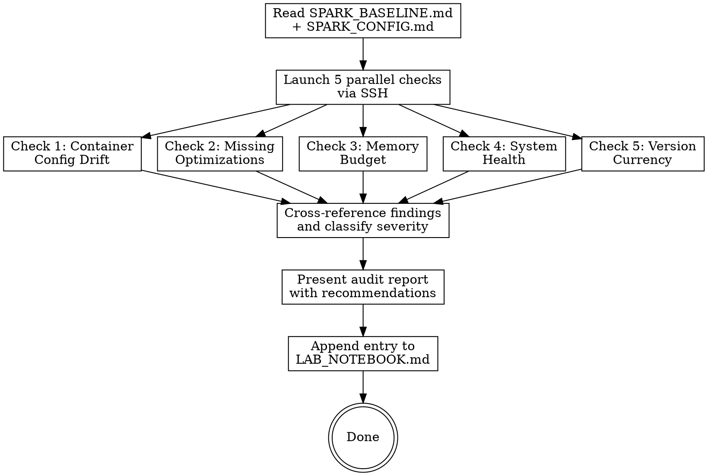

# Spark Audit

Live configuration audit of the DGX Spark inference system. SSHes into the device, inspects running containers, compares against documented best practices and community benchmarks in SPARK_BASELINE.md, and reports optimization opportunities.

**This skill reads the live system. It never modifies it.**

## Required Files

| File | Location | Purpose |
|------|----------|---------|
| `SPARK_BASELINE.md` | Spark project root (`~/dev/personal/spark/`) | Community benchmarks + known-best config to compare against |
| `SPARK_CONFIG.md` | Spark project root | Documented container commands (ground truth for drift detection) |
| `LAB_NOTEBOOK.md` | Spark project root | Append-only audit results log |

## Connection

```bash
ssh -i ~/.ssh/id_claude_code claude@spark.k4jda.net
```

The `claude` user has passwordless sudo for docker, nvidia-smi, systemctl, and other system commands.

## Execution Flow



## The Five Checks

### Check 1 -- Container Config Drift

**Purpose:** Detect differences between documented config (SPARK_CONFIG.md) and actual running config.

**Commands:**
```bash
# For each container: qwen35, qwen3-embed, gliner
docker inspect <name> --format '{{json .Config.Cmd}}'
docker inspect <name> --format '{{json .Config.Env}}'
docker inspect <name> --format '{{json .HostConfig.Binds}}'
docker inspect <name> --format '{{.Config.Image}}'
docker inspect <name> --format '{{json .HostConfig.PortBindings}}'
docker inspect <name> --format '{{json .HostConfig.RestartPolicy}}'
docker inspect <name> --format '{{json .HostConfig.ShmSize}}'
docker inspect <name> --format '{{json .HostConfig.IpcMode}}'
```

**Analysis:**
1. Parse each container's actual flags, env vars, volume mounts, image tag, and port bindings.
2. Compare against the documented docker run commands in SPARK_CONFIG.md.
3. Flag any differences as DRIFT items:
   - **CRITICAL:** Volume mount changes (wrong HF cache path), image tag mismatch, missing GPU access
   - **WARNING:** Flag differences, env var changes, port binding changes
   - **INFO:** Cosmetic differences (ordering, default values made explicit)

**Return:** Per-container drift report with severity classification.

### Check 2 -- Missing Optimizations

**Purpose:** Compare running container flags against known community best practices from SPARK_BASELINE.md.

**Analysis for qwen35 (primary LLM):**

Check for the presence/absence of these flags in the running container config:

| Flag | Best Practice | Severity if Missing |
|------|--------------|-------------------|
| `--speculative-config '{"method":"mtp","num_speculative_tokens":2}'` | MTP=2 for +40% single-stream | HIGH |
| `--attention-backend FLASHINFER` | Explicit FLASHINFER selection | MEDIUM |
| `--enable-prefix-caching` | Cache repeated prefixes | MEDIUM |
| `--enable-chunked-prefill` | Chunked prefill for better scheduling | LOW (may be default) |
| `--load-format fastsafetensors` | Faster model loading | LOW |
| `VLLM_FLASHINFER_MOE_BACKEND=latency` env var | MoE latency mode | MEDIUM |

Check for anti-patterns:
| Anti-Pattern | Check | Severity |
|-------------|-------|----------|
| `VLLM_TEST_FORCE_FP8_MARLIN=1` | Should NOT be set (removed in v0.19.0) | HIGH |
| `--no-async-scheduling` | Should NOT be set (async is better in v0.19.0) | MEDIUM |
| Pre-quantized FP8 model path | `Qwen3.5-35B-A3B-FP8` in model arg = hangs on v0.19.0 | CRITICAL |
| `~/.cache` in volume mounts | Tilde expansion fails in Docker | CRITICAL |

**Analysis for qwen3-embed:**
| Flag | Best Practice | Severity if Missing |
|------|--------------|-------------------|
| `--enforce-eager` | Required for pooling models | CRITICAL |
| `--runner pooling` | Required for embedding mode | CRITICAL |

**Analysis for gliner:**
| Check | Expected | Severity |
|-------|----------|----------|
| `GLINER_DEVICE=cuda` | CUDA acceleration enabled | HIGH |
| HF cache path is user-writable | Not root-owned default cache | MEDIUM |

**Return:** List of missing optimizations with severity and expected impact.

### Check 3 -- Memory Budget

**Purpose:** Verify GPU and system memory allocation is healthy and optimal.

**Commands:**
```bash
nvidia-smi
free -h
swapon --show
cat /proc/swaps
# Per-process GPU memory
nvidia-smi --query-compute-apps=pid,process_name,used_gpu_memory --format=csv,noheader
# Per-process swap (top 5)
for pid in $(ls /proc/[0-9]*/status 2>/dev/null | head -100 | cut -d/ -f3); do
  swap=$(grep VmSwap /proc/$pid/status 2>/dev/null | awk '{print $2}')
  name=$(grep Name /proc/$pid/status 2>/dev/null | awk '{print $2}')
  [ "$swap" -gt 1000 ] 2>/dev/null && echo "$swap kB - $name ($pid)"
done | sort -rn | head -5
```

**Analysis:**

| Metric | Healthy | Warning | Critical |
|--------|---------|---------|----------|
| Swap used | < 100 MB | 100 MB - 1 GB | > 1 GB |
| Available RAM | > 12 GiB | 8-12 GiB | < 8 GiB |
| GPU temp (idle) | < 45C | 45-55C | > 55C |
| GPU temp (load) | < 65C | 65-75C | > 75C |
| Total GPU allocation | < 95 GiB | 95-105 GiB | > 105 GiB |
| Free GPU memory | > 20 GiB | 12-20 GiB | < 12 GiB |

**GPU memory budget calculation:**
1. Sum GPU memory across all processes from nvidia-smi
2. Calculate theoretical max: sum of (gpu-memory-utilization x 121.6 GiB) for all vLLM containers + gliner
3. Compare actual vs theoretical
4. Calculate headroom: 121.6 GiB - actual total
5. Compare gpu-memory-utilization against community best practice:
   - Single-model setups: 0.85
   - Our 3-model setup: 0.75-0.80 (adjusted for embed + gliner)
   - If current < 0.75, flag as OPTIMIZATION OPPORTUNITY

**Return:** Memory budget table, swap status, optimization opportunities.

### Check 4 -- System Health

**Purpose:** Check overall system health indicators.

**Commands:**
```bash
uptime
# Container status and uptime
docker ps --format '{{.Names}}\t{{.Status}}\t{{.Image}}'
# Container restart counts (indicates crashes)
docker inspect --format '{{.Name}} {{.RestartCount}}' $(docker ps -q)
# Health endpoints
curl -s -o /dev/null -w '%{http_code}' http://localhost:8000/health
curl -s -o /dev/null -w '%{http_code}' http://localhost:8001/health
curl -s -o /dev/null -w '%{http_code}' http://localhost:8002/health
# Disk usage
df -h /
# Kernel and driver
uname -r
nvidia-smi --query-gpu=driver_version --format=csv,noheader
# Docker disk usage
docker system df
# dmesg errors (last 20 lines of warnings/errors)
sudo dmesg --level=err,warn | tail -20
# sysctl tuning verification
sysctl vm.swappiness vm.min_free_kbytes
```

**Analysis:**
| Check | Healthy | Warning | Critical |
|-------|---------|---------|----------|
| All health endpoints | 200 | One non-200 | Multiple non-200 |
| Container restart counts | 0 | 1-2 | > 2 |
| Disk usage | < 70% | 70-85% | > 85% |
| System uptime | Stable | < 1 day (recent reboot) | N/A |
| dmesg errors | None relevant | GPU/CUDA warnings | OOM kills, GPU errors |
| vm.swappiness | 1 | 2-10 | > 10 or default (60) |

**Return:** Health status per component, anomalies, restart counts.

### Check 5 -- Version Currency

**Purpose:** Compare running versions against latest known-good versions.

**Commands:**
```bash
# vLLM version in qwen35
docker exec qwen35 python3 -c 'import vllm; print(vllm.__version__)' 2>/dev/null
# vLLM version in qwen3-embed
docker exec qwen3-embed python3 -c 'import vllm; print(vllm.__version__)' 2>/dev/null
# CUDA version
docker exec qwen35 python3 -c 'import torch; print(torch.version.cuda)' 2>/dev/null
# PyTorch version
docker exec qwen35 python3 -c 'import torch; print(torch.__version__)' 2>/dev/null
# FlashInfer version
docker exec qwen35 pip show flashinfer 2>/dev/null | grep Version
# Container image tags
docker inspect qwen35 --format '{{.Config.Image}}'
docker inspect qwen3-embed --format '{{.Config.Image}}'
docker inspect gliner --format '{{.Config.Image}}'
# Driver version
nvidia-smi --query-gpu=driver_version --format=csv,noheader
```

**Analysis:**
Compare against SPARK_BASELINE.md version tracking:
- vLLM: compare against `vllm_latest_observed`
- CUDA toolkit: note cu130 vs cu132 availability
- Driver: compare against known-safe version (580.142)
- FlashInfer: compare against spark-vllm-docker latest (0.6.7)

Flag version gaps:
| Gap | Severity |
|-----|----------|
| vLLM > 1 minor version behind latest | HIGH |
| FlashInfer behind community builds | MEDIUM |
| CUDA toolkit behind community builds (cu130 vs cu132) | LOW |
| Driver behind latest (but only flag if no known regressions) | INFO |
| qwen3-embed on different vLLM than qwen35 | INFO |

**Return:** Version comparison table, upgrade recommendations.

## Overall Classification

After all five checks:

| Status | Criteria |
|--------|----------|
| **NEEDS ATTENTION** | Any CRITICAL finding, or >= 3 HIGH findings |
| **OPTIMIZATION AVAILABLE** | Any HIGH finding (no CRITICAL), missing key optimizations |
| **HEALTHY** | No HIGH or CRITICAL findings, config matches best practices |

## Console Report Format

```
## Spark Audit -- {DATE}
Overall: {NEEDS ATTENTION / OPTIMIZATION AVAILABLE / HEALTHY}

### Container Config Drift
{drift items by container, or "No drift detected"}

### Missing Optimizations
{missing flags/settings with severity and expected impact, or "All known optimizations applied"}

### Memory Budget
| Component | GPU Memory | Utilization Setting | Status |
|-----------|-----------|-------------------|--------|
| qwen35    | {X} GiB   | {Y}               | {OK/HIGH/LOW} |
| qwen3-embed | {X} GiB | {Y}               | {OK} |
| gliner    | {X} GiB   | N/A               | {OK} |
| **Total** | {X} GiB   |                   | {free: Y GiB} |
Swap: {X} MB ({OK/WARNING/CRITICAL})

### System Health
- Uptime: {N} days
- Health endpoints: {all OK / issues}
- Container restarts: {counts}
- Disk: {X}% used
- Thermals: {X}C idle

### Version Currency
| Component | Running | Latest Known | Gap |
|-----------|---------|-------------|-----|
| vLLM (qwen35) | {X} | {Y} | {none/behind} |
| vLLM (embed) | {X} | {Y} | {none/behind} |
| FlashInfer | {X} | {Y} | {none/behind} |
| CUDA toolkit | {X} | {Y} | {none/behind} |
| Driver | {X} | {Y} | {OK/caution} |

### Recommendations
1. {Priority-ordered list of actions, or "System is optimally configured"}
```

## LAB_NOTEBOOK Entry

Append using `Edit` tool. Auto-increment entry number.

```markdown
### Entry {N} -- Spark Audit ({YYYY-MM-DD})
**Date:** {YYYY-MM-DD HH:MM} UTC
**Operator:** Claude Code (spark-audit skill)
**Status:** AUDIT -- no changes made

#### Config Drift: {drift items or "None"}
#### Missing Optimizations: {items or "None"}
#### Memory Budget: GPU {X}/{Y} GiB, swap {X} MB, status {OK/WARNING}
#### System Health: {HEALTHY/DEGRADED/DOWN}
#### Version Currency: {current or behind}
#### Overall: {STATUS}
#### Recommendations: {list or "No action needed"}
```
