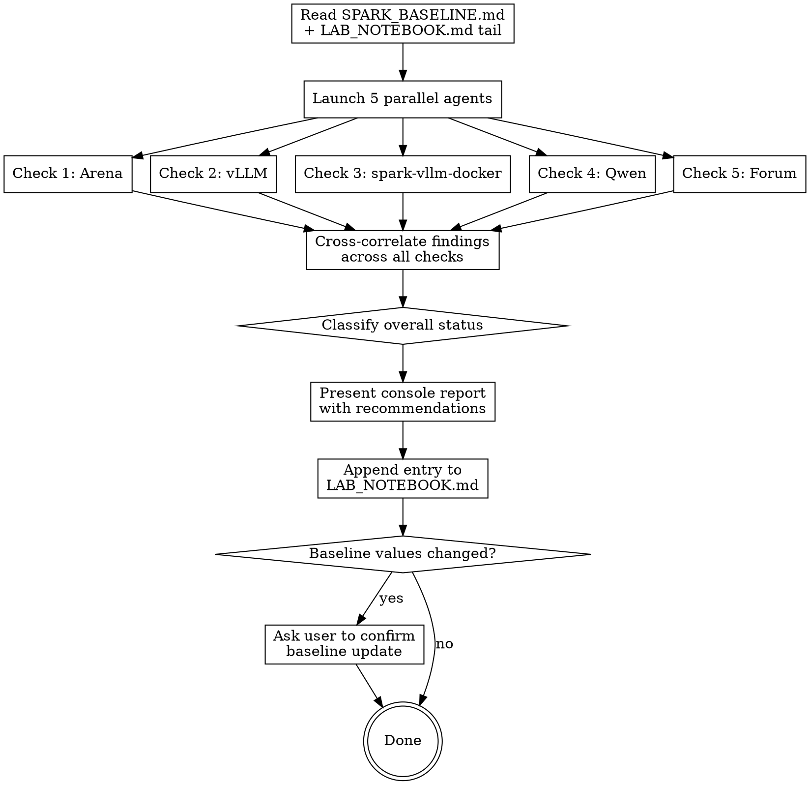

# Spark Recon

Periodic intelligence scan of the DGX Spark inference performance landscape. Five parallel checks, compared against stored baselines, classified by urgency, cross-correlated, results appended to LAB_NOTEBOOK.md.

**This skill is report + recommend only. It never touches the Spark system.**

## Required Files

| File | Location | Purpose |
|------|----------|---------|
| `SPARK_BASELINE.md` | Spark project root (`~/dev/personal/spark/`) | Performance numbers + last-checked dates + watch items |
| `LAB_NOTEBOOK.md` | Spark project root | Append-only results log |

If `SPARK_BASELINE.md` doesn't exist, create it using the template at the bottom of this skill.

## Execution Flow



## The Five Checks

### Check 1 — Spark Arena Leaderboard

**Data source:** `https://spark-arena.com/leaderboard`

**Agent instructions:**
1. Open the Arena leaderboard using browser tools (`mcp__claude-in-chrome__tabs_create_mcp` to create a tab, `mcp__claude-in-chrome__navigate` to the URL, then `mcp__claude-in-chrome__get_page_text` to read it). If browser tools are unavailable, try `WebFetch`.
2. Filter to: **`tg128` test type, concurrency 1, single-node only.** This is the single-request decode benchmark that maps to our baseline tok/s number. We only have one DGX Spark — multi-node results are informational only, not actionable.
3. Identify all FP8-quantized, single-node entries. Focus on Qwen3.5 variants.
4. Record the top FP8 Qwen3.5 single-node entry: model name, tok/s, creator, rank.
5. Compare tok/s against baseline `arena_top_fp8_qwen35_tok_s`.
6. If **10%+ jump**: this is ACTION NEEDED. Click on the entry or use the recipe API (`https://spark-arena.com/api/recipes/{id}/raw`) to get the full recipe. Extract key config differences vs the current config in SPARK_BASELINE.md (env vars, flags, container image, model variant, load-format, batch token settings).
7. Scan the top 5 single-node entries overall. Flag any non-Qwen3.5 model at FP8 or better quality that wasn't there before as a "new contender." Note multi-node entries separately as informational.

**Return:** top FP8 Qwen3.5 single-node entry (name, tok/s, delta %), top overall single-node entry, recipe diff if actionable, any new contenders.

### Check 2 — vLLM Releases

**Data source:** `https://api.github.com/repos/vllm-project/vllm/releases?per_page=5`

**Agent instructions:**
1. `WebFetch` the GitHub releases API.
2. Compare latest release tag against baseline `vllm_last_checked_version`.
3. If new release, scan the release body for keywords and classify:

| Classification | Keywords |
|---------------|----------|
| HIGH | `SM121`, `SM120`, `Blackwell`, `GB10`, `#38126`, `sm_12`, `arch guard` |
| MEDIUM | `prefix caching`, `Mamba`, `hybrid`, `MoE`, `Marlin`, `Qwen3.5`, `mixed architecture` |
| LOW | None of the above |

4. If HIGH, generate a concrete test plan:
   - Exact `docker run --rm` command to verify the image loads on Spark
   - What to check in startup logs (SM121 kernel loading, FP8 warning presence)
   - Rollback note: current image tag from SPARK_BASELINE.md

**Return:** latest version, classification, relevant changelog items, test plan if HIGH.

### Check 3 — spark-vllm-docker Builds

**Data source:** `https://api.github.com/repos/nickyu42/spark-vllm-docker/releases?per_page=5` and `https://api.github.com/repos/nickyu42/spark-vllm-docker/commits?per_page=10`

**Agent instructions:**
1. `WebFetch` the releases API and recent commits.
2. The `spark-vllm-docker` project builds the `vllm-node` containers used by Arena leaderboard entries. New container builds here are a leading indicator of Arena performance jumps.
3. Look for: new container image tags, Dockerfile changes, new recipes, SM121/SM120 kernel patches, FlashInfer updates.
4. Compare against baseline `svd_last_checked_date`.
5. If new container build: note the base vLLM version, any patches applied, target architecture.

**Return:** new releases or commits since last check, any new container images, notable changes.

### Check 4 — Qwen Model Landscape

**Data sources:** HuggingFace + web search

**IMPORTANT CONTEXT: We are ALREADY running `Qwen/Qwen3.5-35B-A3B` with FP8 on-the-fly quantization. This check looks for models NEWER than Qwen3.5, not Qwen3.5 itself.**

**Agent instructions:**
1. If HuggingFace MCP tools are available, use `mcp__claude_ai_Hugging_Face__hub_repo_search` to search for recent models from the Qwen org (>10B parameters, created after 2026-03-01).
2. Also `WebSearch` for: `"Qwen4" model 2026`, `Qwen new model release 2026`, `Qwen3.5 successor`.
3. We already know about and are running Qwen3.5-35B-A3B. Do NOT report it as "new." Look for:
   - New model families (Qwen4, etc.)
   - New variants we don't have: specifically `Qwen/Qwen3.5-35B-A3B-FP8` (pre-quantized) or new fine-tunes
   - Architecture changes in newer models
4. For any genuinely new model: note parameter count, architecture (MoE vs dense, hybrid Mamba vs pure transformer), available quantizations (FP8 pre-quantized?), any published benchmarks.
5. Don't deep-dive. Flag existence and key specs. Switching models is a separate decision.

**Return:** new models found (or "no new models beyond Qwen3.5"), key specs per model, whether pre-quantized FP8 variants exist that we're not using.

### Check 5 — NVIDIA DGX Spark Forum

**Data sources (use Discourse JSON API — append `.json` to URLs):**
- `https://forums.developer.nvidia.com/c/accelerated-computing/dgx-spark-gb10/719.json` (main category)
- `https://forums.developer.nvidia.com/c/accelerated-computing/dgx-spark-gb10/dgx-spark-gb10-projects/720.json` (projects)
- `https://forums.developer.nvidia.com/c/accelerated-computing/dgx-spark-gb10/dgx-spark-gb10-user-forum/721.json` (user forum)

Fall back to HTML only if JSON returns an error.

**Agent instructions:**
1. Fetch the JSON endpoints for each forum category.
2. Scan topics created or updated since baseline `forum_last_checked_date`.
3. Flag posts about: performance improvements, new vLLM builds/images, kernel compilation techniques, driver updates, new model results, SM121/SM120 optimizations, `spark-vllm-docker` updates.
4. Note posts from known community builders: **hellohal2064, Artyom, sus, sesmanovic, namake-taro, coolthor, sggin1, eugr**.
5. Classify each relevant post:

| Classification | Criteria |
|---------------|----------|
| ACTION | New performance result, build technique, or image that could improve our setup |
| INFO | Discussion or question worth reading but not immediately actionable |
| SKIP | Unrelated, basic setup questions, already-known information |

**Return:** post count since last check, ACTION/INFO posts with: title, author, date, link, one-line summary.

## Cross-Correlation

After all five agents return, look for findings that appear in multiple checks:
- A model variant appearing in both Arena recipes AND Qwen/HuggingFace check (e.g., pre-quantized FP8)
- A vLLM version referenced in both releases AND forum posts
- A new container build in spark-vllm-docker AND improved Arena entries
- Forum techniques that explain Arena performance jumps

Note cross-correlated findings in the report — these are higher-confidence signals.

## Overall Classification

After cross-correlation:

| Status | Criteria |
|--------|----------|
| **ACTION NEEDED** | Arena 10%+ jump (single-node), HIGH vLLM release, or significant new model/architecture |
| **WORTH WATCHING** | Arena <10% movement, MEDIUM vLLM release, new forum techniques, incremental model variants |
| **NO ACTION** | Landscape unchanged from baseline |

## Console Report Format

Present to the user:

```
## Spark Recon — {DATE}
Overall: {ACTION NEEDED / WORTH WATCHING / NO ACTION}

### Arena: {status}
- Top FP8 Qwen3.5 (single-node): {tok/s} ({name}) — {delta}% vs baseline
- Top overall (single-node): {tok/s} ({name})
{recipe diff if actionable}
{new contenders if any}

### vLLM: {status}
- Latest: {version} — {classification}
{relevant items}
{test plan if HIGH}

### spark-vllm-docker: {status}
{new builds or "No new builds"}

### Qwen Models: {status}
{findings or "No new models beyond Qwen3.5"}

### Forum: {status}
- {N} new posts since {date}
{ACTION/INFO items}

### Cross-Correlated Findings
{items that appeared in multiple checks, or "None"}

### Recommendations
1. {prioritized actions, or "No action needed"}
```

## LAB_NOTEBOOK Entry

Append using `Edit` tool. Auto-increment entry number by reading the last `### Entry NNN` line.

```markdown
### Entry {N} — Spark Recon ({YYYY-MM-DD})
**Date:** {YYYY-MM-DD HH:MM} UTC
**Operator:** Claude Code (spark-recon skill)
**Status:** RECON — no changes made

#### Arena Check
- Top FP8 Qwen3.5 (single-node): {TOK_S} tok/s ({ENTRY_NAME} by {CREATOR}) — {DELTA}% from baseline
- Top overall (single-node): {TOK_S} tok/s ({ENTRY_NAME})
- {ACTION NEEDED / WORTH WATCHING / NO CHANGE}

#### vLLM Release Check
- Latest: {VERSION} ({DATE})
- Classification: {HIGH / MEDIUM / LOW / NO NEW RELEASE}

#### spark-vllm-docker Check
- {New builds or "No new builds"}

#### Qwen Model Check
- {New models or "No new models beyond Qwen3.5"}

#### NVIDIA Forum Check
- {N} new posts since {DATE}
- {ACTION/INFO items with links}

#### Cross-Correlated Findings
- {Items appearing in multiple checks, or "None"}

#### Overall: {STATUS}

#### Recommendations
1. {Actions or "No action needed — current config remains competitive"}
```

## Baseline Update

After the report, if any **tracking values** changed (Arena numbers, vLLM version seen, forum check date):
1. Show specific changes: `arena_top_fp8_qwen35_tok_s: 52.32 → 58.1`
2. Ask: "Update SPARK_BASELINE.md with these new observed values?"
3. Update only on explicit confirmation.
4. **Never update the `Current Config` section** — that reflects the user's actual running system, not observed external data. Only the user changes that (after implementing a recommendation).
5. Update the `Watch Items` section with any carry-forward notes (e.g., "#38126 awaiting release", "test pre-quantized FP8 next time").

## SPARK_BASELINE.md Template

Create this file in the spark project root if it doesn't exist:

```markdown
# Spark Performance Baseline

Last updated: {DATE}
Last recon: {DATE}

## Current Config
| Field | Value |
|-------|-------|
| image | vllm-custom:sm121-inject |
| model | Qwen/Qwen3.5-35B-A3B |
| single_request_tok_s | 48.6 |
| c16_aggregate_tok_s | 311.7 |
| vllm_version | v0.17.0rc1 |

## Arena Tracking
| Field | Value |
|-------|-------|
| arena_top_fp8_qwen35_tok_s | 52.32 |
| arena_top_fp8_qwen35_entry | Huihui-Qwen3.5-35B-A3B-abliterated (Artyom) |
| arena_top_overall_tok_s | 70.72 |
| arena_top_overall_entry | Qwen3-Coder-Next-int4-AutoRound |

## Version Tracking
| Field | Value |
|-------|-------|
| vllm_last_checked_version | v0.17.1 |
| qwen_current_model | Qwen/Qwen3.5-35B-A3B |

## spark-vllm-docker Tracking
| Field | Value |
|-------|-------|
| svd_last_checked_date | {DATE} |

## Forum Tracking
| Field | Value |
|-------|-------|
| forum_last_checked_date | {DATE} |

## Watch Items
- {Carry-forward notes from previous recon runs}
- {e.g., "#38126 merged to main 2026-03-27, awaiting release"}
- {e.g., "Test pre-quantized Qwen3.5-35B-A3B-FP8 next config change"}
```
