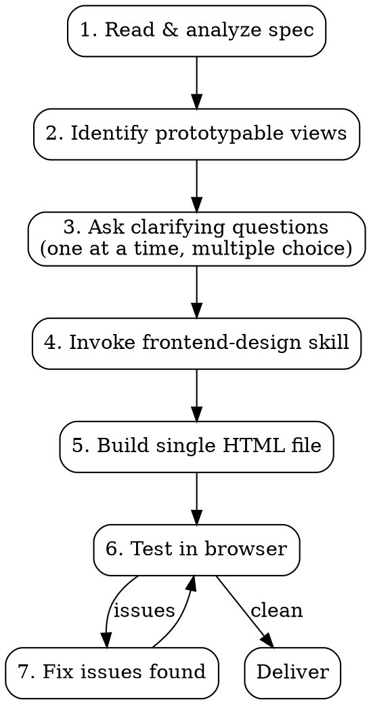

# Spec-to-Prototype Builder

Build self-contained HTML/CSS visual prototypes from specification documents. Produces shareable single-file demos with realistic data and navigation — no backend, no build tools, no framework dependencies.

## When to Use

- User has a spec, reference doc, design system doc, or component description
- Goal is a visual demo, not a functional application
- Stakeholder presentations, design validation, or vision casting
- User says "prototype", "mockup", "dummy UI", "visual demo"

**Not for:** Production apps, functional forms, real data integration, or creative/original UI design (use `frontend-design` skill directly for those).

## Process



### Step 1 — Read the Spec

Read the full spec document. Extract:
- **Components/elements** described (with names, anatomy, behaviors)
- **Layout structure** (shells, sidebars, content areas, navigation)
- **Visual language** (colors, typography, spacing, icons mentioned)
- **Data model** (what entities exist, what fields they have)
- **Interaction patterns** (what opens what, navigation flows)

### Step 2 — Identify Prototypable Views

Determine what can be shown as static views. Propose 2-3 options to the user:
- Which views/scenarios best showcase the spec?
- Which combination hits the most components?
- What's the minimum set of views for maximum stakeholder impact?

### Step 3 — Ask Clarifying Questions

Ask questions **one at a time, multiple choice preferred**. Essential questions:

1. **Which scenario/views to show?** Propose options based on spec analysis. Recommend the option that covers the most components.
2. **Visual fidelity?** (A) Pixel-accurate recreation of existing system, (B) Recognizably accurate but not pixel-perfect, (C) Wireframe/blueprint style. Recommend B unless user specifies.
3. **Data source?** Ask if the user has sample data (CSV, JSON, etc.) to populate the prototype. If not, derive realistic data from the spec.
4. **Single page or multi-page?** Recommend single self-contained HTML file for shareability. If multiple views, use CSS class toggling with minimal JS for navigation.
5. **Any specific persona, branding, or scenario context?** (agent name, company, use case)

Stop asking when you have enough to build. Don't over-question — 3-5 questions is typical.

### Step 4 — Design Direction

Invoke the `frontend-design` skill. The design direction depends on the spec type:

- **Existing system recreation** (e.g., ServiceNow, Salesforce): Match the platform's visual language — colors, fonts, spacing, component patterns. The goal is recognition, not originality. Use Google Fonts for the platform's typeface family.
- **New design from requirements**: Follow the frontend-design skill's creative direction process fully.
- **Wireframe/blueprint**: Gray boxes with labels, structural layout only.

### Step 5 — Build Rules

**Single file, self-contained:**
- One `.html` file with all CSS embedded in `<style>` tags
- External dependencies limited to Google Fonts (typography + Material Symbols for icons)
- All data hardcoded inline — no fetch calls, no external JSON
- File should be sharable via email, Slack, or USB stick with zero setup

**Minimize JavaScript:**
- CSS-only for all visual states (hover, focus, active, badges, colors)
- JS permitted ONLY for view switching between multiple views in the same file
- View switching pattern: CSS classes toggled by ~10-line inline `<script>` at the bottom
- No frameworks, no libraries, no npm

**CSS architecture:**
- CSS custom properties (variables) for all colors, spacing, and sizing
- Logical grouping: shell, header, content, components, utilities
- Mobile-responsive only if requested — default to desktop viewport

**Data realism:**
- If user provided a data file, derive prototype content from real entries
- Generate 10-15 rows for list/table views (enough to feel real, not overwhelming)
- Use realistic names, dates, statuses, IDs — never "Lorem ipsum" or "Test 123"
- Vary data values (mix of priorities, statuses, time ranges)

**Multi-view navigation:**
- Default view visible on load, others hidden with `display: none`
- Both the hidden and visible views need explicit CSS rules for both states
- Clicking a list item opens a detail view; clicking back/tabs returns
- Session tabs persist in header when switching views (match workspace UX)
- Close (X) buttons on tabs remove the tab and return to default view

### Step 6 — Test in Browser

If browser automation tools are available:
1. Start a local HTTP server (`python -m http.server --directory [path] [port]`)
2. Navigate browser to the prototype
3. Screenshot each view
4. Test all navigation paths (click through, switch tabs, close tabs)
5. Check: icons render, badges colored correctly, layout not broken, all views accessible

### Step 7 — Fix Issues

Common bugs to watch for:
- **View toggle CSS:** Both views need explicit display rules. A view without a `display: none` rule in its non-active state will bleed through.
- **Close button scope:** Tab close buttons should `stopPropagation()` to avoid triggering the tab's click handler, then hide both the view AND the tab element.
- **Icon font loading:** Material Symbols requires the Google Fonts link. If icons show as text, the font isn't loading.
- **Overflow:** Long content in fixed-height layouts needs `overflow-y: auto` on scrollable containers.

## Output Structure

```text
prototype/
  [name]-prototype.html    # Single self-contained file
```

Filename should reflect what it prototypes (e.g., `agent-workspace-prototype.html`, `dashboard-prototype.html`).

## Common Mistakes

| Mistake | Fix |
|---------|-----|
| Multiple HTML files | Combine into one with view toggling |
| External CSS file | Embed in `<style>` tags |
| Lorem ipsum data | Use realistic data from spec or user's data source |
| Heavy JS for interactivity | CSS-only states; JS only for view switching |
| Forgetting `display:none` for hidden views | Both active and inactive states need explicit CSS |
| Generic design when recreating existing system | Match the target platform's visual language |
